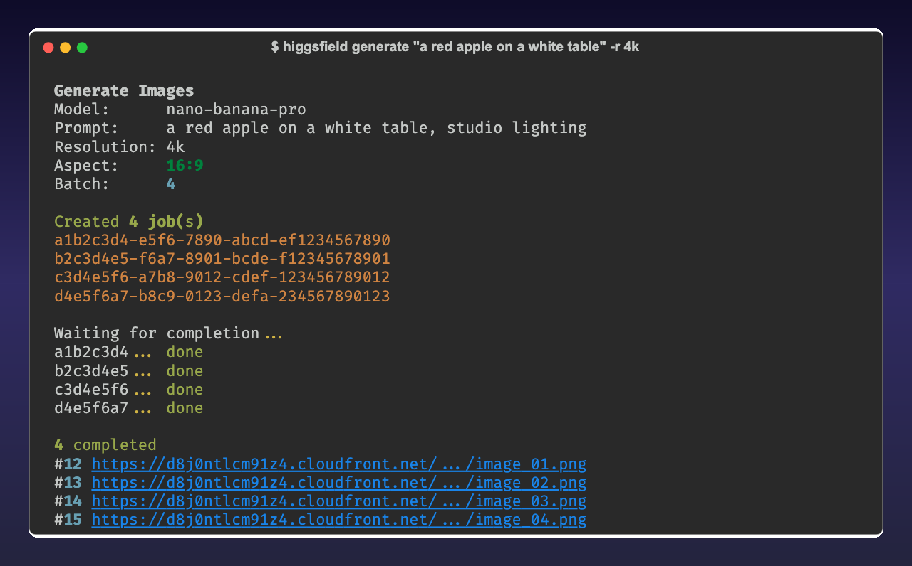
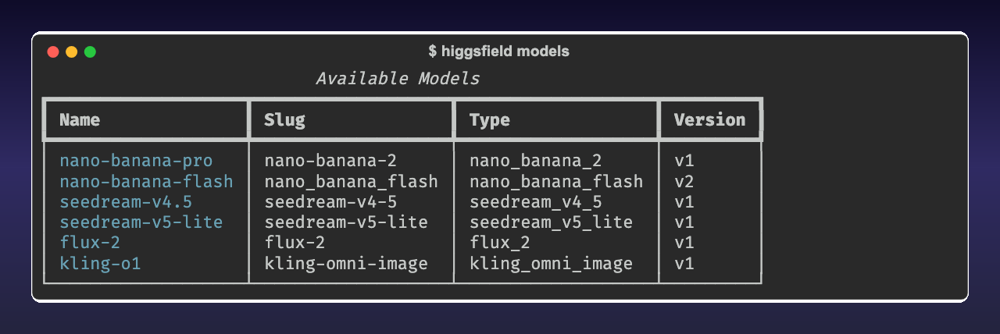
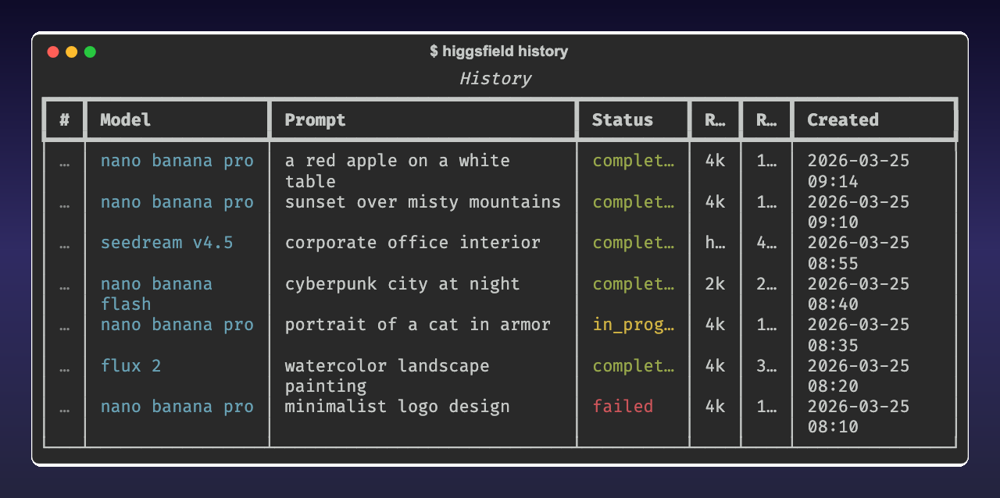

# Higgsfield CLI

AI image generation from the terminal using [Higgsfield](https://higgsfield.ai).

Supports Nano Banana Pro, Nano Banana Flash, Seedream, Flux, and Kling models with batch generation, image-to-image, upscale, relight, and outpaint.



## Install

```sh
pip install higgsfield-cli
```

For Chrome-based auto-refresh (optional):

```sh
pip install "higgsfield-cli[chrome]"
```

## Quick Start

```sh
higgsfield login
higgsfield generate "a red apple on a white table"
higgsfield history
higgsfield download 1
```

## Authentication

Open [higgsfield.ai](https://higgsfield.ai) in Chrome, log in, then:

```sh
higgsfield login
```

Paste `document.cookie` from the browser console when prompted.

After first login, read-only commands (history, credits, download) work indefinitely via Clerk API refresh. Generate commands need a higgsfield.ai tab open in Chrome (DataDome protection).

```sh
higgsfield login                          # Interactive cookie login
higgsfield login --with-token TOKEN       # Direct JWT (expires in 60s)
higgsfield whoami                         # Verify current user
```

## Generate

```sh
higgsfield generate "sunset over mountains"                            # Default settings
higgsfield generate "portrait photo" -m nano-banana-pro -r 4k -a 9:16  # Custom model/res/ratio
higgsfield generate "logo design" -m seedream-v4.5 -q high             # Seedream model
higgsfield generate "scene" -A reference.png                           # With reference image
higgsfield generate "art" -b 2 -d -o ~/Pictures                       # 2 images, auto-download
higgsfield generate "cube" -m nano-banana-flash -r 1k -b 1 -y         # Fast, cheap, no confirm
```

## Models



| Model | Flag | Options |
|-------|------|---------|
| Nano Banana Pro | `-m nano-banana-pro` | `-r 4k/2k/1k` (default) |
| Nano Banana Flash | `-m nano-banana-flash` | `-r 4k/2k/1k` |
| Seedream v4.5 | `-m seedream-v4.5` | `-q high/basic`, `--seed N` |
| Seedream v5 Lite | `-m seedream-v5-lite` | `-q high/basic`, `--seed N` |
| Flux 2 | `-m flux-2` | `-r 4k/2k/1k` |
| Kling O1 | `-m kling-o1` | `-r 4k/2k/1k` |

Aspect ratios: `1:1`, `16:9`, `9:16`, `4:3`, `3:4`, `21:9`, `9:21`, `3:2`, `2:3`

```sh
higgsfield models       # List all models
```

## Enhancement

```sh
higgsfield upscale 1                           # Upscale to higher resolution
higgsfield relight 1                           # AI-adjusted lighting
higgsfield outpaint 1 --direction right        # Extend image borders
```

## History & Download



```sh
higgsfield history                             # Recent 20 jobs
higgsfield history --max 50 --model nano-banana-pro
higgsfield status 1                            # Check job status
higgsfield download 1 2 3 -o ~/Pictures        # Download completed images
higgsfield download 1 --thumbnail              # Download thumbnail
higgsfield open 1                              # Open in browser
```

## Watch

Live progress tracking with auto-download:

```sh
higgsfield watch --all                         # Watch all pending jobs
higgsfield watch 1 2 3 --download              # Watch specific jobs
```

## Re-run & Reference

```sh
higgsfield again 1                             # Same prompt, new seed
higgsfield again 1 --seed 42                   # Specific seed
higgsfield use 1 "make it more colorful"       # Use image as reference
```

## Batch

```sh
higgsfield batch prompts.txt -d -o ./output    # One prompt per line
```

Lines starting with `#` and empty lines are skipped.

## Management

```sh
higgsfield favorite 1 2 3                      # Toggle favorite
higgsfield delete 1 2 3                        # Delete (with confirmation)
higgsfield credits                             # Credit balance
higgsfield free-gens                           # Free generations per model
```

## JSON Output

All commands output JSON when piped:

```sh
higgsfield history | jq '.data[0].prompt'
higgsfield credits | jq '.data.subscription_balance'
```

Envelope format:

```json
{"ok": true, "schema_version": "1", "data": ...}
```

## Configuration

`~/.config/higgsfield-cli/config.yaml`:

```yaml
model: nano-banana-pro
resolution: 4k
quality: high
aspect_ratio: "16:9"
batch_size: 4
auto_download: false
output_dir: "."
```

## Environment Variables

| Variable | Description |
|----------|-------------|
| `HIGGSFIELD_TOKEN` | Override bearer token |
| `HIGGSFIELD_CLI_CACHE` | Cache dir (default: `~/.cache/higgsfield-cli`) |
| `HIGGSFIELD_CLI_CONFIG` | Config dir (default: `~/.config/higgsfield-cli`) |

## ID System

Jobs get display numbers (#1, #2, ...) mapped to UUIDs. Run `higgsfield history` to populate, then use numbers in all commands:

```sh
higgsfield history          # Shows #107, #108...
higgsfield download 107     # By display number
higgsfield again 107        # Re-run by number
```

## Disclaimer

This is an **unofficial** community tool. It is not affiliated with, endorsed by, or associated with Higgsfield AI in any way.

This CLI interacts with Higgsfield's web API. Use responsibly and in accordance with [Higgsfield's Terms of Service](https://higgsfield.ai). The authors are not responsible for any misuse, account restrictions, or API changes that may affect functionality.

**This project is provided as-is, without warranty.** Higgsfield may change their API at any time, which could break this tool.

## License

MIT
